# React-Native-Restaurant-Order
tested on bado.com.tr

## Gerekli Paketler

```
dependencies": {
    "axios": "^0.18.0",
    "native-base": "^2.4.2",
    "react": "16.3.1",
    "react-native": "0.55.3",
    "react-native-communications": "^2.2.1",
    "react-native-easy-grid": "^0.1.17",
    "react-native-fit-image": "^1.5.4",
    "react-native-image-progress": "^1.1.0",
    "react-native-maps": "^0.21.0",
    "react-native-material-bottom-navigation": "^0.9.0",
    "react-native-progress": "^3.4.0",
    "react-native-storage": "^0.2.2",
    "react-native-vector-icons": "^4.6.0",
    "react-navigation": "^1.5.11",
    "realm": "^2.3.5"
  }
```

## Ekran Görüntüleri

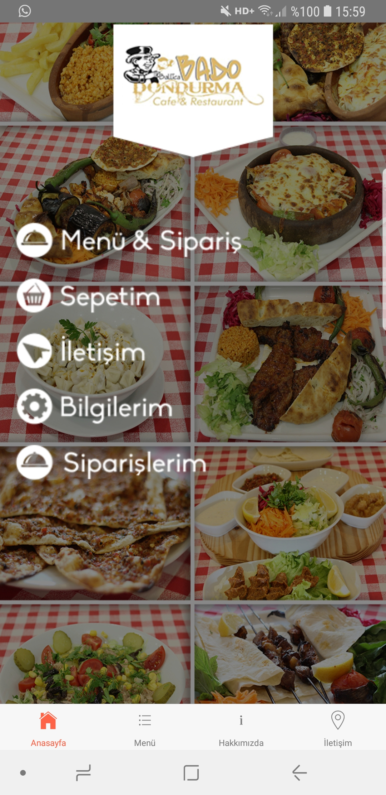
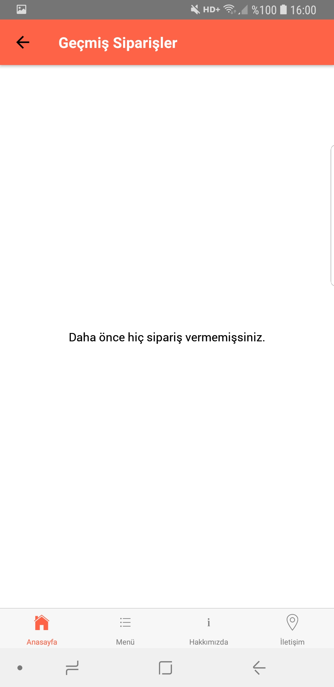
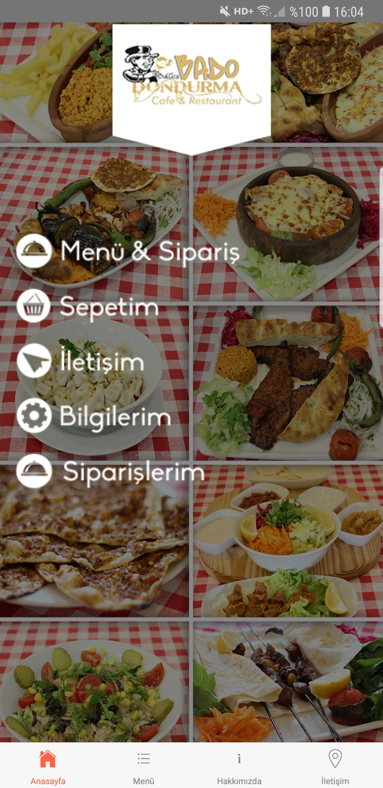
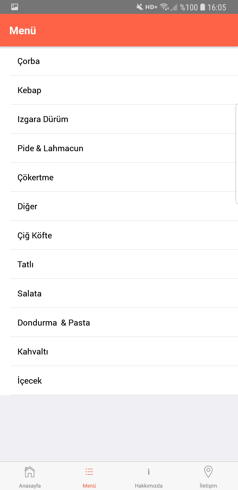
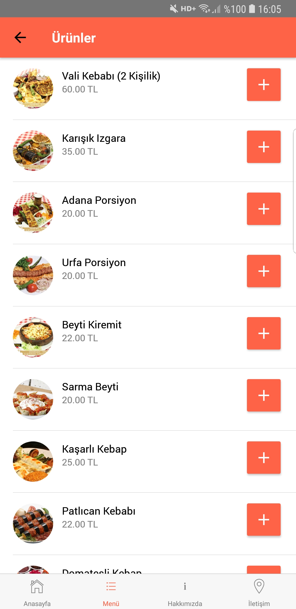
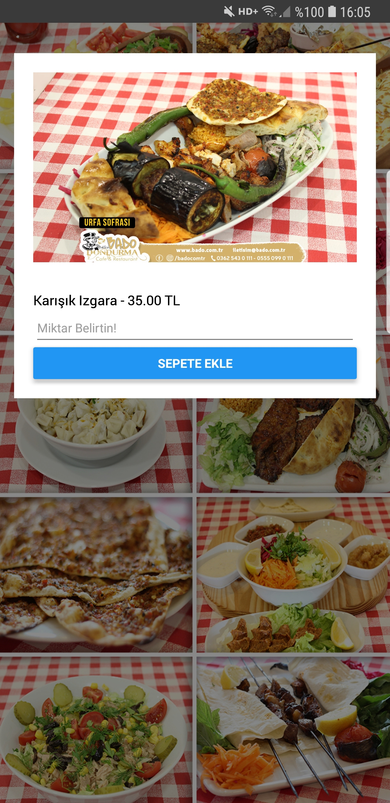
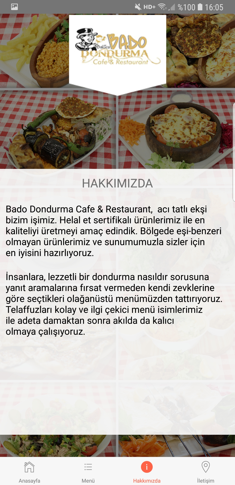
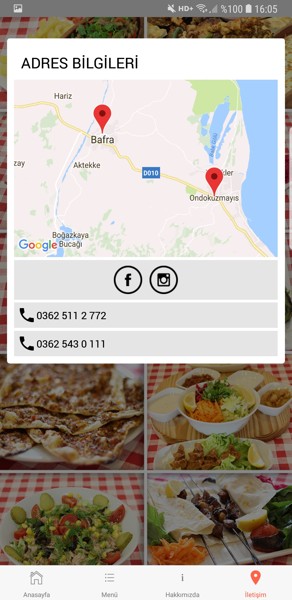
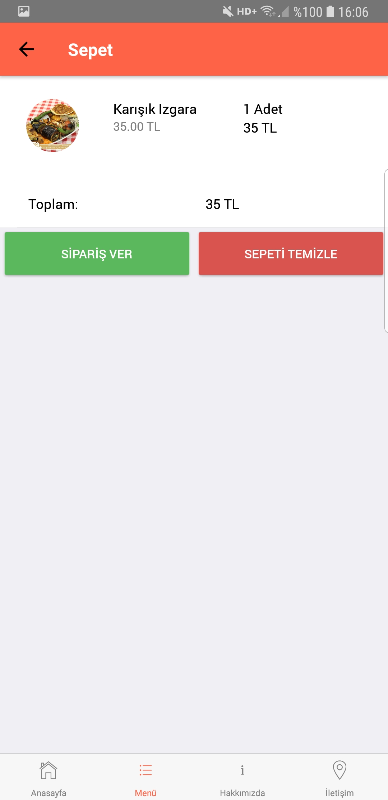
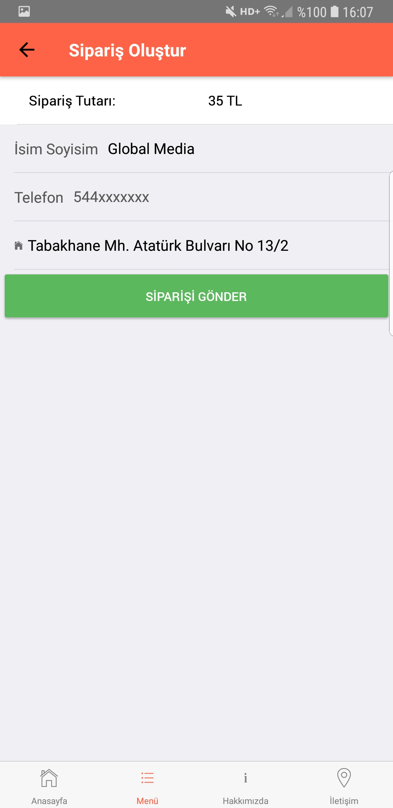
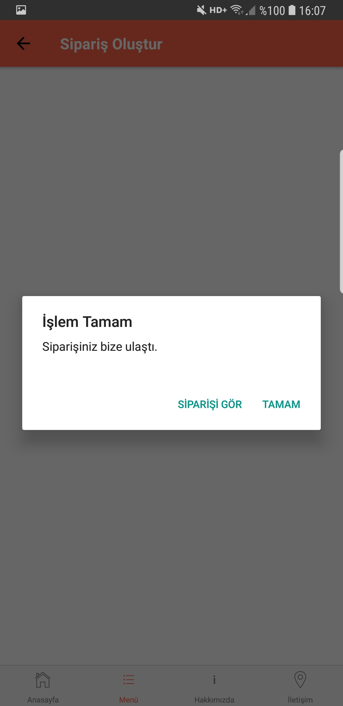
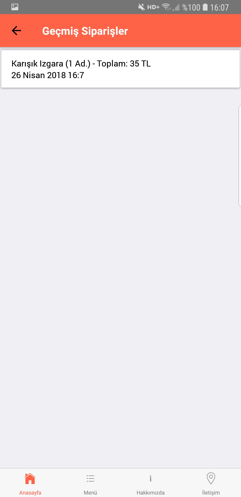
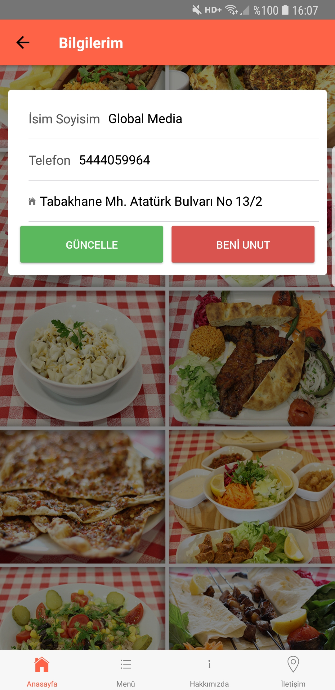